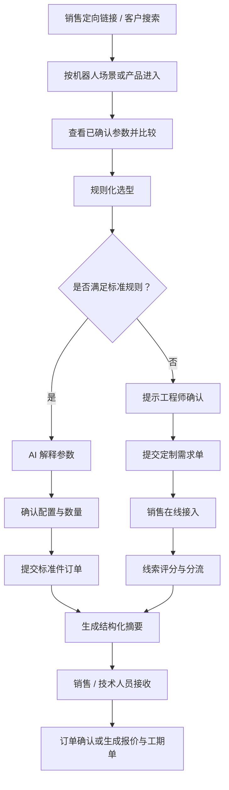
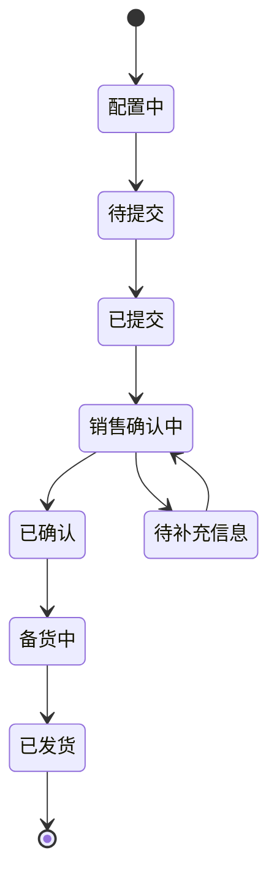
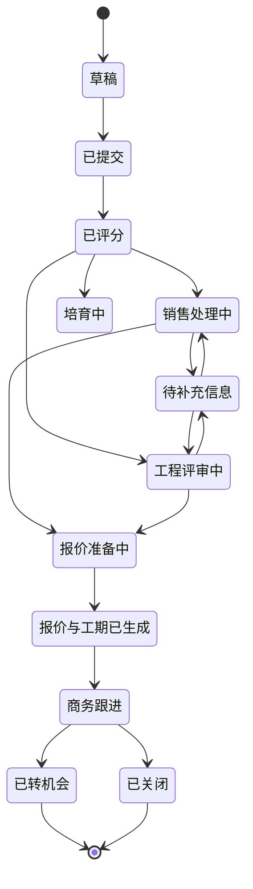

# JOYNEXT 机器人部件选型平台

## 产品业务流程与功能说明

| 项目 | 内容 |
|---|---|
| 文档版本 | V1.0 |
| 产品阶段 | 交互原型 / MVP |
| 面向对象 | 产品、销售、售前技术、研发、运营与项目管理人员 |
| 核心目标 | 将机器人部件“发现—理解—选型—询价/下单—销售跟进”的流程线上化和结构化 |

> 说明：本文件描述首版产品逻辑与验收范围。页面中的价格、库存、交期、线索评分和服务时效均为原型演示信息，不构成正式商务承诺；最终产品参数、系统兼容性、报价和交付计划需由 JOYNEXT 授权人员确认。

## 1. 产品背景

机器人客户在选择控制器、传感器、执行器等核心部件时，通常面临以下问题：

- 产品资料分散，难以快速判断参数是否已确认。
- 客户多从机器人任务出发，而不是从零部件分类出发。
- 标准件和定制件共用同一套销售沟通方式，处理效率低。
- 复杂问题容易被 AI 或前台页面“过度承诺”，缺少工程边界。
- 销售和技术人员收到的需求信息不完整，需要反复追问。
- 线索缺少统一评分和分流规则，影响响应速度和成交跟进。

本产品以机器人场景和产品搜索为入口，将需求自动分为两条路径：

1. 参数明确的标准件进入规则化选型和下单流程。
2. 涉及工程状态、结构定制、复杂兼容或交付约束的需求进入销售与工程师联合评估流程。

## 2. 产品目标

### 2.1 客户目标

- 快速找到适用于当前机器人场景的产品。
- 区分“已确认参数”和“需要工程师确认的事项”。
- 在同一页面完成参数查看、比较、配置和下一步提交。
- 标准件可以直接形成订单，复杂需求可以快速接入销售。
- 清楚了解提交后的负责人、响应时效和交付物。

### 2.2 业务目标

- 提高有效线索的完整度和可处理性。
- 减少销售、售前和研发之间的信息转述损耗。
- 将常见标准件需求自动化，降低人工筛选成本。
- 对高价值或复杂项目进行优先分流。
- 为后续 CRM、ERP、CPQ 和知识库接入提供统一数据结构。

### 2.3 首版关键结果

- 至少完整跑通两条路径：标准件直接选型下单、定制件提交需求并约定报价和工期。
- 用户能在无需人工协助的情况下完成标准件配置。
- 定制需求提交后自动生成结构化摘要。
- 销售和技术人员能明确看到需求优先级、缺失信息和建议动作。
- 对工程状态或兼容性风险给出明确人工确认提示。

## 3. 用户与角色

| 角色 | 主要诉求 | 主要操作 |
|---|---|---|
| 潜在客户 | 了解产品和能力 | 搜索、浏览场景、查看参数、对比产品 |
| 采购客户 | 获取价格、交期和样品 | 配置标准件、提交订单、申请样品或询价 |
| 研发/系统工程师客户 | 验证规格和兼容性 | 查看参数来源、询问 AI、提交技术约束 |
| 销售人员 | 快速识别高价值线索 | 接收评分、查看摘要、联系客户、创建机会 |
| 售前/技术人员 | 判断可行性和风险 | 接收技术摘要、补充信息、给出配置建议 |
| 运营管理员 | 管理线索与规则 | 查看队列、配置评分与分流规则、跟踪 SLA |

## 4. 总体业务流程

### 4.1 业务阶段

| 阶段 | 客户动作 | 系统动作 | 业务输出 |
|---|---|---|---|
| 发现 | 打开定向链接或搜索 | 识别入口、关键词和场景 | 推荐场景与产品列表 |
| 理解 | 查看产品参数和资料 | 标注参数状态与来源 | 已确认参数、风险提示 |
| 比较 | 选择多个候选产品 | 展示关键差异 | 对比结果与建议 |
| 选型 | 输入接口、数量、环境等 | 执行规则匹配 | 标准配置或人工确认提示 |
| 决策 | 查看 AI 解释 | 解释参数并守住工程边界 | 推荐理由、缺失信息 |
| 转化 | 下单或提交定制需求 | 生成订单/需求单 | 标准订单或定制需求单 |
| 分流 | 等待业务响应 | 评分、路由、设置 SLA | 负责人和优先级 |
| 跟进 | 补充信息、确认方案 | 生成结构化摘要 | 报价单、工期单或订单确认 |

## 5. 路径 A：标准件直接选型下单

### 5.1 适用条件

同时满足以下条件时进入标准件路径：

- 产品为已发布的标准型号。
- 核心参数、接口和使用环境在规则库覆盖范围内。
- 不涉及结构修改、特殊材料、定制协议或超规格运行。
- 数量和交付时间在标准销售策略范围内。
- 产品不是必须经过工程评审的初步工程状态。

### 5.2 操作流程

1. 用户通过搜索、场景页或销售定向链接进入产品。
2. 系统展示产品图片、型号、应用说明和已确认参数。
3. 用户查看同类产品或推荐组合。
4. 用户选择接口、环境、数量和计划交付时间。
5. 系统执行规则校验并返回：
   - 配置可用；
   - 有条件可用；
   - 需要工程师确认。
6. AI 根据已提供资料解释关键参数和推荐原因。
7. 用户确认配置、数量、价格提示和交期提示。
8. 用户提交标准件订单。
9. 系统生成订单号和结构化摘要。
10. 销售收到订单并确认库存、正式价格和发货安排。

### 5.3 标准件页面功能

| 功能 | 说明 | 首版 |
|---|---|---|
| 产品列表 | 展示型号、类别、图片、参数摘要和交期提示 | P0 |
| 产品选择 | 单选一个产品进入配置 | P0 |
| 参数状态 | 标识“已确认”“工程状态”“待确认” | P0 |
| 配置项 | 接口、数量、环境、计划交付 | P0 |
| 规则校验 | 根据产品状态和配置返回可下单或需确认 | P0 |
| AI 参数解释 | 解释接口、量程、适用条件和风险 | P0 |
| 配置摘要 | 汇总型号、选项、数量、价格和交期 | P0 |
| 标准订单 | 生成订单号和处理进度 | P0 |
| 多产品对比 | 横向比较关键规格 | P1 |
| 样品申请 | 标准件样品数量和用途申请 | P1 |

### 5.4 规则示例

| 规则 | 条件 | 系统结果 |
|---|---|---|
| 标准接口匹配 | 所选接口在产品资料范围内 | 允许继续 |
| 批量交期确认 | 数量超过 10 件 | 提醒销售确认批量交期 |
| 工程状态拦截 | 产品处于初步工程状态 | 禁止直接下单，转定制流程 |
| 环境风险 | 使用环境超过已确认范围 | 请求工程师确认 |
| 系统兼容风险 | 涉及整机兼容、安全或法规 | 请求工程师确认 |
| 信息缺失 | 必填配置未完成 | 禁止提交 |

### 5.5 标准订单状态

## 6. 路径 B：定制件销售与工程师接入

### 6.1 触发条件

满足以下任一情况时进入定制路径：

- 用户主动选择“提交定制需求”。
- 标准规则无法覆盖当前配置。
- 产品处于工程开发或初步工程状态。
- 涉及结构尺寸、安装方式、散热或功耗定制。
- 涉及特殊通信协议、软件接口或多产品系统集成。
- 涉及安全、法规、认证或最终设计判断。
- 目标数量、交付周期或商务条件需要单独评估。

### 6.2 操作流程

1. 用户填写项目名称和机器人场景。
2. 用户用自然语言描述任务目标、已有平台和关键约束。
3. 用户填写公司、联系人、预计用量和优先级。
4. 用户可附加需求文档、图纸、BOM 或接口文件。
5. 系统检查必填项和信息完整度。
6. AI 将自然语言需求整理为结构化摘要。
7. 系统根据业务和技术信息计算线索评分。
8. 系统将需求路由到销售、技术或培育队列。
9. 用户获得需求单号、负责人和服务时效。
10. 销售进行首次联系并补充商务信息。
11. 工程师评估参数、兼容性、风险和交付边界。
12. 在约定时限内生成报价单和初步工期单。

### 6.3 定制需求字段

| 字段组 | 字段 | 必填 | 用途 |
|---|---|---:|---|
| 项目信息 | 项目名称 | 是 | 识别项目 |
| 项目信息 | 机器人场景 | 是 | 路由产品团队 |
| 项目信息 | 需求描述 | 是 | 提取技术需求 |
| 商务信息 | 公司名称 | 是 | 识别客户主体 |
| 商务信息 | 联系人 | 是 | 销售跟进 |
| 商务信息 | 手机或邮箱 | 是 | 建立联系 |
| 商务信息 | 预计年用量 | 否 | 线索评分和产能评估 |
| 项目阶段 | 概念、样机、验证、量产 | 否 | 判断成熟度 |
| 时间信息 | 目标样机/量产时间 | 否 | 工期评估 |
| 技术信息 | 接口、尺寸、功耗、环境 | 否 | 工程评估 |
| 附件 | PDF、PPT、STEP、BOM 等 | 否 | 提高需求完整度 |
| 优先级 | 常规、紧急样机、量产项目 | 是 | 队列优先级 |

### 6.4 定制需求状态

## 7. AI 参数解释与工程边界

### 7.1 AI 可以完成

- 对产品资料中已有参数进行通俗解释。
- 说明不同接口、量程和配置的适用场景。
- 根据已确认规则给出推荐理由。
- 识别用户需求中的关键实体和缺失信息。
- 生成销售与技术人员可读的结构化摘要。
- 推荐下一步动作：继续配置、补充信息或请求工程师支持。

### 7.2 AI 不可以独立完成

- 对资料中不存在的参数进行推测。
- 承诺最终系统兼容性。
- 替代安全、法规、认证和最终设计评审。
- 承诺正式价格、库存、交期或质量责任。
- 在未经过工程确认的情况下批准超规格使用。

### 7.3 回答状态

| 状态 | 展示方式 | 后续动作 |
|---|---|---|
| 已确认 | 绿色标识并注明资料来源 | 允许进入规则化配置 |
| 有条件确认 | 蓝色说明适用前提 | 用户确认条件 |
| 信息不足 | 提示缺失字段 | 引导用户补充 |
| 工程师确认 | 黄色风险提示 | 转定制流程或请求技术支持 |
| 不支持 | 红色提示原因 | 推荐替代产品或人工联系 |

## 8. 线索评分与分流

### 8.1 评分维度

建议首版采用 100 分制。具体权重由业务团队配置。

| 维度 | 示例规则 | 建议分值 |
|---|---|---:|
| 公司完整度 | 公司、联系人和联系方式完整 | 10 |
| 项目阶段 | 已进入样机或验证阶段 | 15 |
| 预计用量 | 年需求量明确且较高 | 20 |
| 时间明确度 | 样机或量产时间明确 | 10 |
| 产品匹配度 | 已匹配到明确产品或产品组合 | 15 |
| 需求完整度 | 接口、环境、尺寸和性能描述完整 | 15 |
| 商务意图 | 明确要求报价、样品或技术会议 | 10 |
| 来源价值 | 销售定向链接或重点活动来源 | 5 |

### 8.2 分流规则

| 条件 | 队列 | 建议动作 |
|---|---|---|
| 评分 ≥ 70，标准产品匹配 | 销售高优先级 | 2 小时内联系并确认订单 |
| 评分 ≥ 70，包含复杂技术约束 | 销售 + 工程联合队列 | 安排技术评审 |
| 工程状态或系统兼容问题 | 工程评审队列 | 技术验证和系统选型 |
| 评分 40–69 | 普通销售队列 | 1 个工作日内联系 |
| 评分 < 40 或信息明显不足 | 培育队列 | 自动请求补充信息 |
| 紧急样机 | 加急队列 | 优先确认样品和资源 |

### 8.3 SLA 建议

| 事项 | 首版目标 |
|---|---|
| 定制需求提交确认 | 即时 |
| 高优先级线索首次联系 | 2 小时内 |
| 普通线索首次联系 | 1 个工作日内 |
| 工程问题初步反馈 | 1 个工作日内 |
| 报价单和初步工期单 | 2 个工作日内 |

## 9. 销售与技术人员结构化摘要

### 9.1 摘要内容

- 线索编号、来源和提交时间。
- 客户公司、联系人和联系方式。
- 机器人场景、项目阶段和目标时间。
- 客户原始需求和 AI 提炼后的需求。
- 已选择产品、配置项、数量和候选替代产品。
- 已确认参数、未确认参数和风险提示。
- 缺失信息列表。
- 线索评分、优先级和评分原因。
- 路由队列、负责人和 SLA 剩余时间。
- 推荐下一步动作。

### 9.2 摘要示例

> 客户计划在人形机器人项目中使用 nRB-H1 域控制器，处于样机验证阶段，目标年用量 100–500 套。客户需要 EtherCAT、24–48 V DC 供电和硬实时控制。产品资料支持上述方向，但当前产品处于初步工程状态，散热、功耗、机械安装和整机兼容性仍需工程确认。建议销售在 2 小时内联系客户，并安排域控制器工程师进行技术评审。

## 10. 功能架构

| 模块 | 子功能 | 说明 |
|---|---|---|
| 首页与入口 | 搜索、热门关键词、定向链接 | 将用户带入场景或产品 |
| 场景中心 | AMR、人形、机械臂等 | 按任务组织产品 |
| 产品中心 | 列表、筛选、详情、资料 | 展示产品和已确认参数 |
| 对比工具 | 参数横向比较 | 支持候选产品决策 |
| 规则选型 | 输入、匹配、校验 | 形成标准配置 |
| AI 助手 | 参数解释、风险提示 | 提升理解并守住边界 |
| 标准订单 | 配置摘要、提交、状态 | 完成标准件转化 |
| 定制需求 | 表单、附件、提交 | 收集复杂项目需求 |
| 线索中心 | 评分、分流、SLA | 支持销售运营 |
| 销售工作台 | 线索详情、分配、机会 | 推进商务跟进 |
| 技术工作台 | 工程评审、缺失信息、结论 | 形成技术建议 |
| 通知集成 | 邮件、企业微信、CRM | 将摘要分发给负责人 |

## 11. 首版范围

### 11.1 P0：首版必须完成

- 首页搜索与场景入口。
- 产品卡片和已确认参数展示。
- 标准件产品选择与配置。
- 标准件规则判断。
- AI 参数解释和工程师确认提示。
- 标准件订单提交与订单确认。
- 定制需求表单。
- 线索评分和分流结果展示。
- 销售在线接入状态。
- 销售与技术人员结构化摘要。
- 报价单和工期单生成时效约定。
- 桌面端与移动端适配。

### 11.2 P1：下一阶段

- 产品多选比较。
- 销售定向链接携带产品和来源信息。
- 真实文件上传。
- 真实账号与权限体系。
- CRM、ERP、CPQ 和邮件系统接入。
- 真实库存、价格和交期。
- 后台评分与分流规则配置。
- 销售/技术工作台。
- 报价单和工期单 PDF 生成。
- 客户补充信息和消息通知。

### 11.3 不在首版范围

- 在线支付。
- 自动签署正式合同。
- AI 自动批准系统兼容性。
- AI 自动承诺质量、安全或法规结论。
- 无人工确认的正式报价和交期承诺。

## 12. 核心数据对象

| 对象 | 关键字段 |
|---|---|
| Product | 产品 ID、型号、分类、场景、状态、图片、资料版本 |
| Parameter | 参数名、值、单位、状态、来源、适用条件 |
| Configuration | 产品、选项、数量、环境、交付时间、规则结果 |
| StandardOrder | 订单号、客户、配置、金额提示、状态、负责人 |
| CustomRequest | 需求单号、项目、场景、原始描述、附件、状态 |
| Lead | 来源、评分、优先级、队列、负责人、SLA |
| AISummary | 需求摘要、已确认信息、缺失信息、风险、建议动作 |
| QuotePlan | 报价负责人、生成时限、状态 |
| SchedulePlan | 工程评估范围、预计工期、风险和依赖 |

## 13. 非功能要求

### 13.1 可用性

- 关键流程应支持键盘和触摸操作。
- 必填项、错误状态和风险提示必须清晰。
- 移动端不得出现横向溢出或关键按钮不可见。
- 用户在任一节点都能返回上一步修改。

### 13.2 性能

- 首屏主要内容应快速可见。
- 产品图片使用压缩格式和合理尺寸。
- 搜索和规则反馈在原型数据量下即时返回。

### 13.3 安全与合规

- 不在前端暴露内部价格策略、评分权重或敏感工程资料。
- 联系方式和附件应按企业隐私规则处理。
- AI 回答需记录资料来源和风险状态。
- 正式报价、交期和工程结论必须具有人员确认记录。

### 13.4 可追溯性

- 参数需关联资料版本。
- 规则匹配需记录命中规则。
- 线索评分需记录评分原因。
- 销售和技术人员的状态变更需保留操作日志。

## 14. 首版验收标准

### 14.1 标准件路径

- 用户能从首页进入标准件选型。
- 用户能选择产品并查看至少四项已确认参数。
- 用户能修改接口、数量、环境和计划交付。
- 普通标准件能提交并生成订单号。
- 工程状态产品无法绕过人工确认直接下单。
- 提交后显示销售确认和后续处理状态。

### 14.2 定制件路径

- 用户能填写项目、场景、需求和联系信息。
- 缺少必填信息时不能提交。
- 提交后生成唯一需求单号。
- 页面展示线索评分和分流结果。
- 页面展示销售和技术接收状态。
- 页面明确承诺“报价单 + 初步工期单”的预计生成时限。
- 页面展示结构化摘要。

### 14.3 响应式与内容

- 桌面端和移动端均可完成两条路径。
- 产品图片和参数内容来自项目提供资料。
- 工程状态、演示价格和演示交期均有边界说明。

## 15. 后续决策项

进入真实开发前，业务团队需要确认：

1. 哪些产品可以直接下单，哪些产品必须询价。
2. 正式价格、库存和交期的数据来源。
3. 线索评分权重与高优先级阈值。
4. 销售与技术团队的组织和路由关系。
5. 销售首次联系及报价/工期单的正式 SLA。
6. CRM、ERP、CPQ、邮件或企业微信的接入顺序。
7. 产品资料、参数和 AI 知识库的审核与发布流程。
8. 客户附件的存储、权限和保留策略。
